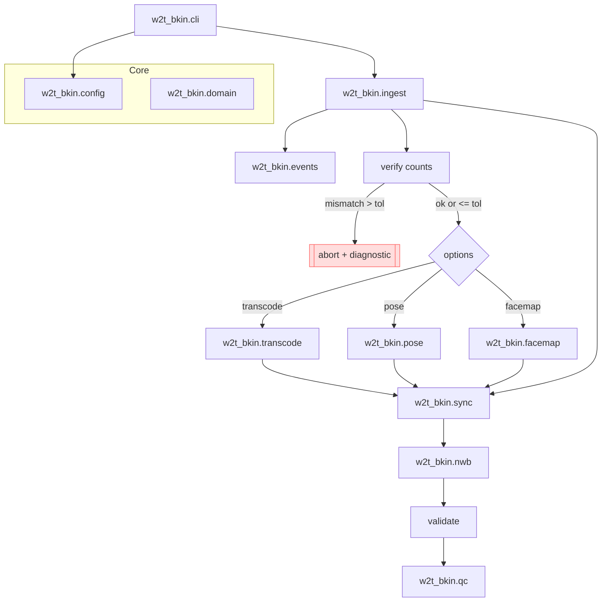
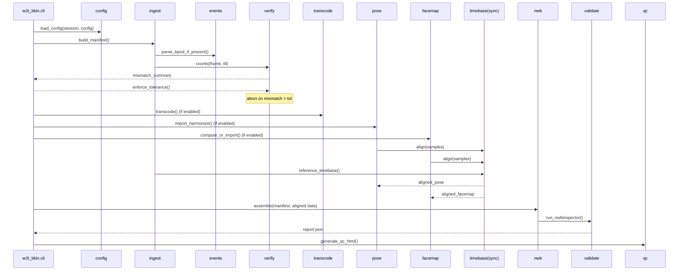
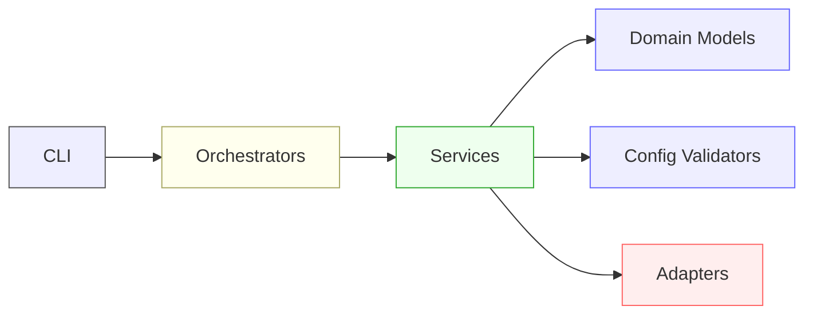
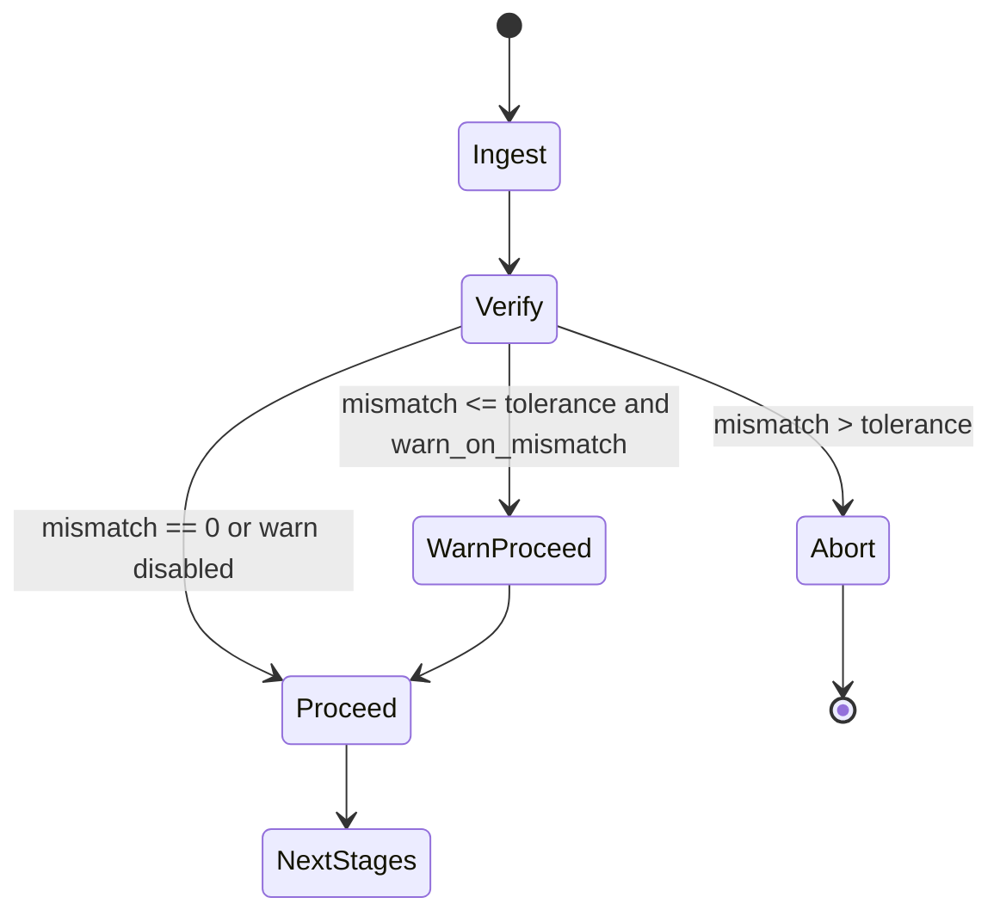
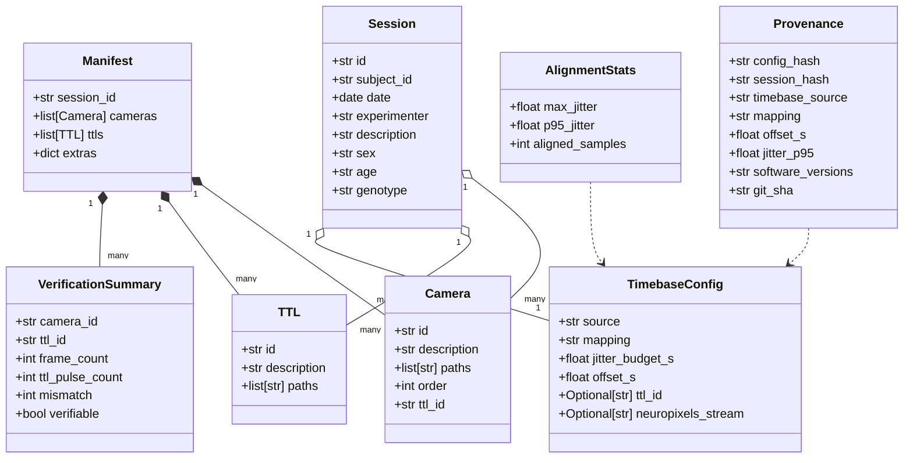
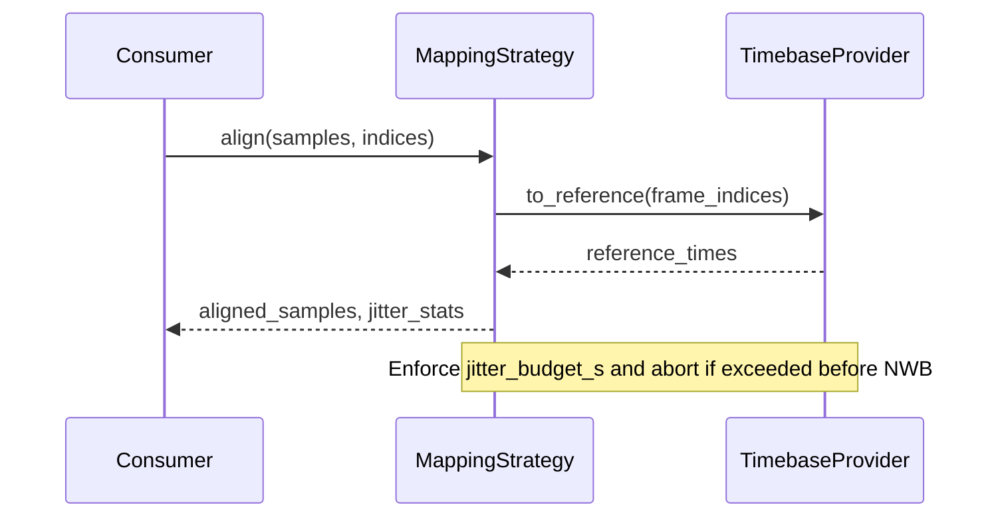
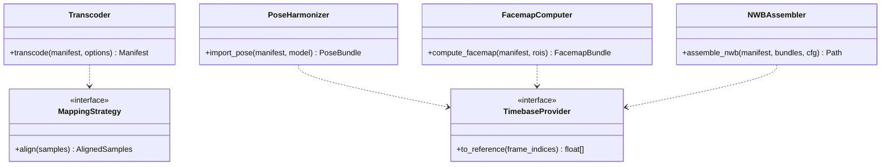

## Overview

This document synthesizes the system design derived from the structured requirements in `requirements.md`. It
covers architecture, core data models, timebase alignment strategy, stage contracts, observability, and quality
assurance. The design aims for deterministic, idempotent, and modular execution with clear provenance.

## Scope and assumptions

- In scope: ingestion, verification (frame vs TTL counts), optional transcode, optional pose/facemap import,
  timebase alignment, NWB assembly, validation, and QC reporting.
- Out of scope: camera calibration, cross-camera optical fusion/triangulation, embedding raw videos into NWB by
  default. See OOS notes in `requirements.md`.

## Toolset module architecture



Key properties:

- Toolset-first design: each capability lives in its own importable subpackage under `w2t_bkin.*`.
- The CLI orchestrates module calls in the correct order, but modules are usable directly in notebooks or scripts.
- Strict, early validation and fail-fast behavior on invalid schemas or integrity violations.
- Optional stages are pluggable and isolated; composition occurs via files and domain contracts, not cross-imports.
- All ImageSeries remain rate-based; timebase affects alignment of derived data only.

### CLI orchestration (sequence)



## Design principles and layering



- Dependencies point inward: Services depend on Domain and Config; Adapters are leaf dependencies.
- Orchestrators coordinate Services; CLI is a thin UX shell over Orchestrators.
- No cross-imports between sibling services; composition happens via contracts and sidecar artifacts.

## Sidecar artifact schemas (illustrative)

verification_summary.json

```
{
  "schema_version": 1,
  "session_id": "<str>",
  "cameras": [
    {
      "camera_id": "<str>",
      "ttl_id": "<str|null>",
      "frame_count": 0,
      "ttl_pulse_count": 0,
      "mismatch": 0,
      "verifiable": true,
      "status": "ok|warn|unverifiable"
    }
  ],
  "generated_at": "<RFC3339>"
}
```

alignment_stats.json

```
{
  "schema_version": 1,
  "timebase_source": "nominal_rate|ttl|neuropixels",
  "mapping": "nearest|linear",
  "offset_s": 0.0,
  "max_jitter_s": 0.0,
  "p95_jitter_s": 0.0,
  "aligned_samples": 0
}
```

provenance.json

```
{
  "schema_version": 1,
  "config_hash": "<sha256>",
  "session_hash": "<sha256>",
  "software": {"python": "3.x", "pynwb": "x.y", "nwbinspector": "x.y"},
  "git": {"sha": "<commit>", "dirty": false},
  "timebase": {"source": "ttl", "mapping": "linear", "offset_s": 0.0}
}
```

qc_report_context.json

```
{
  "schema_version": 1,
  "session_id": "<str>",
  "verification": { /* embedded verification_summary */ },
  "pose": {"confidence_hist": [/* bins */]},
  "facemap": {"signals_preview": [/* samples */]},
  "bpod": {"trials_total": 0, "events": ["Start", "Reward", "End"]}
}
```

## Error catalog and handling

- CONFIG_MISSING_KEY, CONFIG_EXTRA_KEY, SESSION_MISSING_KEY, SESSION_EXTRA_KEY
- CAMERA_UNVERIFIABLE
- MISMATCH_EXCEEDS_TOLERANCE
- JITTER_EXCEEDS_BUDGET
- PROVIDER_RESOURCE_MISSING (e.g., missing TTL or Neuropixels stream)
- EXTERNAL_TOOL_ERROR (ffmpeg/nwbinspector)

Error payload shape:

```
{
  "error_code": "MISMATCH_EXCEEDS_TOLERANCE",
  "message": "Camera cam2 mismatch 42 > tolerance 20",
  "context": {"camera_id": "cam2", "frame_count": 101242, "ttl_pulse_count": 101200, "mismatch": 42},
  "hint": "Increase tolerance or inspect dropped frames",
  "stage": "verify"
}
```

## Concurrency and performance model

- I/O-bound tasks (ffprobe, file discovery): thread pool with bounded workers.
- CPU-bound tasks (pose parsing/aggregation): process pool when needed; prefer vectorized ops.
- Limit concurrent transcodes to avoid disk thrash; configurable `max_workers`.
- Complexity targets:
  - build_manifest: O(n_files)
  - verify_counts: O(n_cameras)
  - align (nearest/linear): O(n_samples)
  - assemble_nwb: O(n_objects)

## Provenance canonicalization algorithm

1. Parse TOML to Python dicts.
2. Strip comments and normalize whitespace (parser-level).
3. Recursively sort all mapping keys.
4. Serialize with compact JSON (`separators=(',', ':')`, `ensure_ascii=False`).
5. Compute SHA256 over UTF-8 bytes → `config_hash` / `session_hash`.

## Test traceability matrix (summary)

- FR-1/2/3: tests/unit/test_ingest.py::test_discovery_and_verify_abort
- FR-4: tests/unit/test_transcode.py::test_transcode_idempotent
- FR-5/6: tests/unit/test_pose_facemap.py::test_alignment_and_confidence
- FR-7: tests/integration/test_to_nwb.py::test_external_rate_based_imageseries
- FR-8/9: tests/integration/test_report_validate.py
- A16/A19: tests/validation/test_session_bpod_order.py, tests/validation/test_derived_counts.py
- Property/idempotence: tests/property/test_reproducibility.py

## State machine — ingestion & verification



## Plugin and extension architecture

- Entry points (optional): `w2t_bkin.pose_plugins`, `w2t_bkin.facemap_plugins`.
- Plugins register harmonizers/computers adhering to public interfaces.
- Discovery via `importlib.metadata.entry_points()`; failures isolated and logged as warnings.

## Privacy and security considerations

- Subject anonymization: deterministic mapping (salted hash) from raw subject IDs; store mapping in a secure sidecar excluded from NWB.
- Path sanitization: reject upward traversal, normalize paths, and restrict subprocess args.
- Checksums (optional): SHA256 per input file recorded in provenance for integrity.
- External tool pinning: validate minimum versions of ffmpeg/nwbinspector at runtime; record in provenance.

## Module toolset (subpackage responsibilities)

- w2t_bkin.config

  - Parse and validate strict TOML config and session files (Pydantic models).
  - Canonicalize and hash config/session for provenance.
  - Public API:
    - load_config(path: str, env: Mapping) -> Config
    - load_session(path: str) -> Session
    - validate_config_session(cfg: Config, ses: Session) -> None

- w2t_bkin.domain

  - Frozen data models: Session, Camera, TTL, TimebaseConfig, Manifest, VerificationSummary, Provenance, AlignmentStats.
  - Serialization helpers for JSON sidecars.

- w2t_bkin.ingest

  - Discover inputs; verify existence; build `manifest.json`.
  - Compute video frame counts and TTL pulse counts via metadata readers.
  - Public API: build_manifest(cfg: Config, ses: Session) -> Manifest

- w2t_bkin.events

  - Optional Bpod `.mat` parsing into Trials/Events; summary for QC.
  - Public API: parse_bpod(files: list[Path]) -> BpodSummary

- w2t_bkin.transcode

  - Optional mezzanine generation using ffmpeg/ffprobe; idempotent outputs with content-addressed paths.
  - Public API: transcode(manifest: Manifest, opts: TranscodeOptions) -> Manifest

- w2t_bkin.pose

  - Import and harmonize DLC/SLEAP outputs to a canonical skeleton; preserve confidences.
  - Public API: import_pose(manifest: Manifest, model: PoseModel) -> PoseBundle

- w2t_bkin.facemap

  - Compute or import facial metrics; ROI support; streaming-friendly.
  - Public API: compute_facemap(manifest: Manifest, rois: list[ROI]) -> FacemapBundle

- w2t_bkin.sync (timebase)

  - Timebase providers (nominal, ttl, neuropixels) and mapping strategies (nearest, linear).
  - Enforce jitter budgets; return alignment indices and jitter stats.
  - Public API:
    - make_timebase(cfg: TimebaseConfig, manifest: Manifest) -> TimebaseProvider
    - align(strategy: MappingStrategy, samples: Samples) -> AlignedSamples, AlignmentStats

- w2t_bkin.nwb

  - Assemble NWB with Devices, ImageSeries (external_file, rate-based), ndx-pose, BehavioralTimeSeries.
  - Inject provenance metadata and configuration hashes.
  - Public API: assemble_nwb(manifest: Manifest, bundles: Bundles, cfg: Config) -> Path

- w2t_bkin.qc
  - Run validators (nwbinspector), generate QC HTML report with verification and summaries.
  - Public API:
    - run_nwbinspector(nwb_path: Path) -> ValidationReport
    - render_qc(template: Path, context: dict) -> Path

## Domain model (contracts)



Notes:

- Models are implemented as frozen Pydantic models or dataclasses with validation.
- Optionality is explicit and minimized; defaults and assumptions are recorded in provenance.

## Timebase strategy and alignment

- Providers: `NominalRateProvider`, `TTLProvider`, `NeuropixelsProvider` implement a common interface to map frame
  indices to reference times.
- Mapping strategies: `NearestMapping` and `LinearMapping` operate on indices/time and return aligned samples plus
  jitter statistics. Linear should reduce cumulative jitter on synthetic tests (Acceptance A20).
- Enforcement: If computed jitter exceeds `timebase.jitter_budget_s`, abort before NWB assembly (A17).



### Public API contracts (sketch)



## Configuration and schema

## NWB assembler inventory and invariants

Objects created per session (minimum viable; optional blocks gated by available data):

- Device (per camera)

  - name: camera id
  - description: from session TOML

- ImageSeries (per camera)

  - name: camera id (or image_series/camera_id)
  - external_file: list of absolute paths to video files
  - starting_time: 0.0 (unless configured offset applied to video-derived data elsewhere)
  - rate: nominal frame rate used for rate-based timing
  - format: external
  - device: link to camera Device
  - Invariants:
    - len(external_file) equals number of declared video parts for that camera
    - ImageSeries uses rate-based timing; no per-frame timestamps

- ndx-pose container (optional; present if pose bundle provided)

  - skeleton definition: canonical joint list and edges
  - data: positions array [n_samples, n_joints, 2 or 3]
  - confidence: [n_samples, n_joints]
  - rate/starting_time derived from session reference timebase mapping (not ImageSeries timestamps)

- BehavioralTimeSeries for Facemap (optional)

  - data_interfaces keyed by signal name (e.g., pupil, face_motion)
  - each series aligned to session reference timebase (rate/starting_time consistent with mapping)

- Processing/General metadata
  - provenance JSON embedded (see provenance.json shape) or stored as a ProcessingModule named "provenance"

Assembly constraints:

- Deterministic ordering: sort devices and series by camera_id; stable container names
- External links remain external; file existence verified on assemble
- All aligned modalities (pose/facemap) must pass derived consistency validation (below)

## Pose harmonization specification

Canonical skeleton:

- JSON document with fields: `name`, `joints: [str]`, `edges: [[int,int]]`, `reference_frame` (pixel)
- Coordinate system: image pixel coordinates (x right, y down); origin at top-left of each camera frame
- Multi-camera fusion: explicitly out-of-scope; per-camera harmonization only

Import rules:

- DLC/SLEAP inputs mapped to canonical joints by name; missing joints filled with NaN and confidence=0
- Multiple detections: retain highest confidence per joint per frame
- Confidence preserved; no normalization unless an optional flag is introduced later

Alignment:

- Pose sample indices map to the session reference timebase via mapping strategy (nearest/linear)
- PoseBundle includes: positions, confidence, alignment_stats, skeleton metadata, mapping strategy, source identifiers

## Facemap ROI and alignment specification

ROI schema:

- `{ id: str, description: str, polygon: [[x,y], ...] }` in pixel coordinates

Signals:

- Named time series (e.g., `pupil_area`, `face_motion`) each with sampling_rate and samples array

Alignment:

- Convert signal frame indices to reference timebase indices
- nearest: choose closest reference time
- linear: interpolate between bracketing reference times

QC expectations:

- Provide preview window (first N samples) and summary stats (mean, std, min, max) per signal in qc_report_context

## Bpod data model

Trials TimeIntervals:

- Columns: `id:int`, `start_time:float`, `end_time:float`, `outcome:str`, `metadata:dict?`

BehavioralEvents:

- Columns: `time:float`, `event_type:str`, `trial_id:int`, `metadata:dict?`

Concatenation:

- Order by `[[bpod.files]].order` ascending; duplicates or gaps → error code SESSION_ORDER_INVALID
- Event times expressed in session reference timebase; not used for video timing decisions

QC aggregation:

- trial_count, event_type_counts (dict), outcome_counts (dict)

## Derived data consistency validation

Algorithm:

1. Derive reference time index sequence from TimebaseProvider
2. For each aligned series S (pose positions per camera, each facemap signal):
   - expected_n = length of reference index (or mapped subset if modality has lower rate)
   - diff = |len(S) - expected_n|
   - if diff > tolerance_samples → raise DERIVED_COUNT_MISMATCH (context: modality, camera_id, diff, expected_n)
3. Record per-series diff and jitter stats into alignment_stats.json

## Timebase assumptions and policies

Offset application:

- Apply `timebase.offset_s` inside provider before mapping; jitter computed post-offset

Frame rate selection:

- Use config-specified nominal rate; fallback to metadata only if explicitly allowed (not default)

Missing TTL pulses:

- Accept gaps below a `ttl_gap_threshold`; bigger gaps trigger PROVIDER_RESOURCE_MISSING

TTL deduplication:

- Pulses closer than `ttl_debounce_interval` merged into single logical pulse

Jitter metrics:

- `max_jitter_s = max(|ref_t[i] - aligned_t[i]|)`
- `p95_jitter_s = percentile(|ref_t[i] - aligned_t[i]|, 95)`
- Budget enforcement prior to NWB assembly; exceed → JITTER_EXCEEDS_BUDGET

- Single source of truth in Pydantic models; strict TOML schema with enumerations and conditional requirements.
- Canonicalization for hashing: strip comments, sort keys, re-serialize, then compute deterministic hashes recorded in
  provenance (A18).
- Environment overrides layered on file defaults; resolved config is logged and embedded.

## Pipeline stages and contracts

- ingest: Input discovery and manifest creation; validates paths and session references. Output: `manifest.json` and
  `verification_summary.json` placeholder initialized.
- verify: Reads counts via metadata (ffprobe, TTL logs), computes mismatches, and writes `verification_summary.json`.
  Aborts on mismatch > tolerance (A6). Warns conditionally per config (A7). Cameras with missing `ttl_id` are flagged
  `verifiable=false` (A15).
- transcode (optional): When enabled, creates mezzanine; otherwise operates on raw videos with clear logs (FR-4).
- pose/facemap (optional): Import or compute signals; align to reference timebase via strategy; persist alignment stats.
- to-nwb: Assembles NWB with external_file ImageSeries (rate-based), ndx-pose, and BehavioralTimeSeries.
- validate: Runs nwbinspector; saves full report; must contain no critical issues (A2).
- report: Generates QC HTML summarizing verification, pose confidence, facemap previews, and optional Bpod summary.

Each stage writes a JSON summary sidecar and uses structured logging for observability.

## Error handling and observability

- Exception taxonomy: ConfigurationError, ValidationError, IntegrityError, ProcessingError, ExternalToolError. All
  exceptions carry `.code`, `.context`, and `.hint` for actionable remediation.
- Logging: JSON logs with `stage`, `session_id`, `run_id`, `duration_ms`, `status`. Summaries: `verification_summary`,
  `alignment_stats`, `provenance`, `validation_report`.

## Provenance and reproducibility

- Record config/session hashes, timebase selection, mapping, offsets, jitter stats, software and git versions.
- Deterministic ordering of devices and series in NWB to ensure stable artifacts across runs (NFR-1, NFR-2).

## Extensibility and plugins

- Optional stages (pose, facemap, inference) adhere to simple interfaces and can be registered via entry points.
- Feature flags allow experimental modules without destabilizing the core.

## Testing strategy (traceability)

- Unit: validators (positive/negative), timebase providers, mapping jitter behavior.
- Property: reproducibility hashes, idempotent re-runs.
- Integration: `ingest → to-nwb → validate → report` on synthetic sessions (A1). Golden metadata checks for NWB.
- Edge cases: missing `ttl_id`, tolerance boundaries, invalid enums, non-contiguous Bpod orders, jitter budget exceeded.

## Quality gates

- Pre-commit: ruff, black, mypy (strict), and schema checks for JSON sidecars.
- CI: matrix across Python versions; fast unit jobs and slower integration jobs; upload NWB and HTML reports as artifacts.

## Decision records and documentation

- Maintain decision records for key trade-offs (e.g., mapping strategies, provenance fields). Keep `requirements.md`,
  this `design.md`, and `tasks.md` synchronized as the source of truth per the spec-driven workflow.
