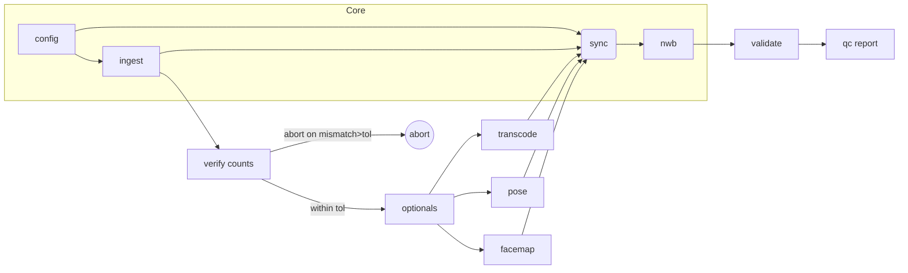
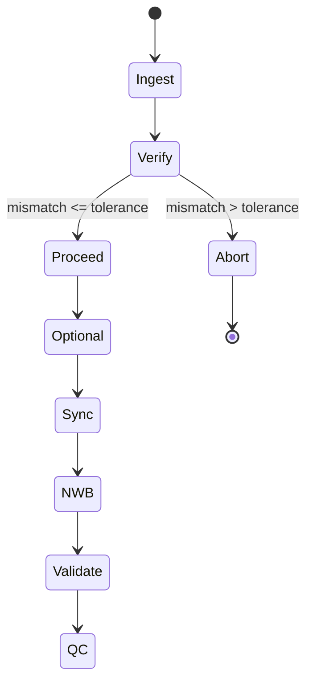
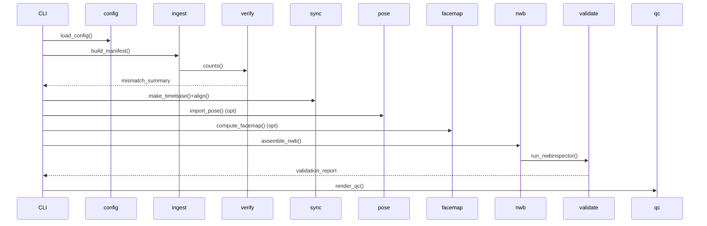

## Overview

Concise architecture ensuring all Functional (FR) and Non-Functional (NFR) requirements are met with minimal surface area. Core themes: strict schemas, early verification, single reference timebase for derived data (ImageSeries always rate-based), deterministic/idempotent outputs, and pluggable optional stages.

## Scope

In scope: ingest → verify → (optional: transcode | pose | facemap | bpod) → align (timebase) → assemble NWB → validate → QC. Out of scope: calibration, triangulation, embedding raw videos internally.

## Architecture (simplified)

Principles:
1. No cross-imports between sibling service packages.
2. Composition through files + domain models only.
3. Fail fast before heavy processing.
4. Sidecars for observability (verification, alignment, provenance, validation).
5. All outputs deterministic when inputs unchanged.

## Module Responsibilities (minimal contracts)

| Module | Key Input | Output / Contract | FR/NFR Coverage |
|--------|-----------|-------------------|-----------------|
| config | config.toml, session.toml | validated Config, Session, hashes | FR-10, FR-15, FR-TB-* NFR-10/11 |
| domain | none | Pydantic models (immutable) | FR-12 NFR-7 |
| utils | primitives | hashing, path safety, subprocess wrappers, logging | NFR-1/2/3 |
| ingest+verify | Config, Session | manifest.json, verification_summary.json (abort/warn logic) | FR-1/2/3/13/15/16 |
| sync | Config(Timebase), Manifest | alignment indices + alignment_stats.json (budget enforced) | FR-TB-1..6, FR-17, A17 |
| transcode (opt) | Manifest | updated Manifest (mezzanine paths) | FR-4, NFR-2 |
| pose (opt) | Manifest, timebase | PoseBundle (aligned) | FR-5 |
| facemap (opt) | Manifest, timebase | FacemapBundle (aligned) | FR-6 |
| events (opt) | Bpod .mat files | Trials/Events summary | FR-11/14 |
| nwb | Manifest + bundles + provenance | NWB file (rate-based ImageSeries) | FR-7 NFR-6 |
| validate | NWB | nwbinspector report | FR-9 |
| qc | NWB + sidecars | QC HTML | FR-8/14 NFR-3 |

## Sidecar Schemas (summary)

verification_summary.json: { session_id, cameras:[{camera_id, ttl_id|null, frame_count, ttl_pulse_count, mismatch, verifiable, status}], generated_at }
alignment_stats.json: { timebase_source, mapping, offset_s, max_jitter_s, p95_jitter_s, aligned_samples }
provenance.json: { config_hash, session_hash, software:{...}, git:{...}, timebase:{source,mapping,offset_s}, created_at }
validation_report.json: nwbinspector structured output (no critical issues required)

## Error Taxonomy

Codes: CONFIG_MISSING_KEY, CONFIG_EXTRA_KEY, SESSION_MISSING_KEY, SESSION_EXTRA_KEY, CAMERA_UNVERIFIABLE, MISMATCH_EXCEEDS_TOLERANCE, JITTER_EXCEEDS_BUDGET, PROVIDER_RESOURCE_MISSING, DERIVED_COUNT_MISMATCH, EXTERNAL_TOOL_ERROR.
Shape: { error_code, message, context:{...}, hint, stage }.

## Timebase Strategy (Reference Only)

Provider (nominal|ttl|neuropixels) chosen via config; mapping strategy (nearest|linear) aligns derived samples; jitter metrics (max, p95) computed and compared to budget. Abort prior to NWB if budget exceeded (A17). ImageSeries timing untouched (rate-based invariant).

## Build Order & Dependencies

1. Foundation: utils, domain, config
2. Ingest+Verify
3. Sync (timebase + alignment)
4. Optional modalities (transcode, pose, facemap, events)
5. NWB assembly
6. Validation + QC

## Requirement Coverage (condensed matrix)

| Requirement Group | Implemented By |
|-------------------|----------------|
| FR-1/2/3/13/15/16 | ingest+verify |
| FR-4 | transcode |
| FR-5 | pose |
| FR-6 | facemap |
| FR-7 | nwb (plus sync for derived alignment) |
| FR-8/9/14 | qc + validate + events |
| FR-10 | config |
| FR-11 | events |
| FR-12 | modular package layout |
| FR-17 + FR-TB-* | sync + provenance |
| NFR-1/2 | deterministic ordering + hashing (utils, nwb) |
| NFR-3 | sidecars + JSON logging |
| NFR-4 | concurrency model + O(n) verification |
| NFR-5 | cross-platform Python tooling |
| NFR-6 | rate-based ImageSeries in nwb |
| NFR-7 | plugin-compatible optional modules |
| NFR-8 | ingest existence + optional checksums |
| NFR-9 | anonymization policy (utils) |
| NFR-10/11 | config + provenance |
| NFR-12 | pytest + CI gating |
| NFR-13 | sync abstraction |

## Testing & Quality Gates

Unit: config/session validation, mismatch logic, timebase jitter computation, hashing reproducibility.
Property: reproducible config/session hashes, linear vs nearest jitter comparison (A20).
Integration: ingest → nwb → validate → qc on synthetic fixtures (A1/A2/A3/A4/A5).
Edge: unverifiable camera, tolerance boundary, jitter budget exceeded, missing ttl_id, duplicate Bpod order.
CI: pre-commit (ruff, black, mypy), unit matrix, integration job storing NWB + QC artifacts.

## Security & Privacy

Path sanitization, restricted subprocess arguments, optional checksums, deterministic anonymized subject IDs (salted hash), no PII in logs.

## Extensibility

Entry points: `w2t_bkin.pose_plugins`, `w2t_bkin.facemap_plugins`. Failures isolated; warnings logged; core unaffected.

## Sequence & State (Minimal)

## Provenance (Determinism)

Canonicalization: strip comments → sort keys → compact JSON → SHA256. Record timebase selection and jitter metrics. Ensures reproducibility (NFR-1) and traceability (FR-17, A18).

## Summary

Design reduced to essential contracts and flow while maintaining full requirements coverage, reproducibility, modularity, and observability. For extended rationale or detailed schemas, see `spec/spec-design-w2t-bkin-simplified.md` and `spec/*` schema specs.
