## Overview

Concise architecture ensuring all Functional (FR) and Non-Functional (NFR) requirements are met with minimal surface area. Core themes: strict schemas, early verification, single reference timebase for derived data (ImageSeries always rate-based), deterministic/idempotent outputs, and pluggable optional stages.

## Scope

In scope: ingest → verify → (optional: transcode | pose | facemap | bpod) → align (timebase) → assemble NWB → validate → QC. Out of scope: calibration, triangulation, embedding raw videos internally.

## Architecture (simplified)


Principles:

1. No cross-imports between sibling service packages.
2. Composition through files + domain models only.
3. Fail fast before heavy processing.
4. Sidecars for observability (verification, alignment, provenance, validation).
5. All outputs deterministic when inputs unchanged.

## Module Responsibilities (minimal contracts)

| Module          | Key Input                              | Output / Contract                                                                                 | FR/NFR Coverage                  |
| --------------- | -------------------------------------- | ------------------------------------------------------------------------------------------------- | -------------------------------- |
| config          | config.toml, session.toml              | validated Config, Session, hashes                                                                 | FR-10, FR-15, FR-TB-\* NFR-10/11 |
| domain          | none                                   | Pydantic models (immutable)                                                                       | FR-12 NFR-7                      |
| utils           | primitives                             | hashing, path safety, subprocess wrappers, logging                                                | NFR-1/2/3                        |
| ingest+verify   | Config, Session                        | Manifest model (Python), manifest.json (phase stub), verification_summary.json (abort/warn logic) | FR-1/2/3/13/15/16                |
| sync            | Config(Timebase), Manifest             | alignment indices + alignment_stats.json (budget enforced)                                        | FR-TB-1..6, FR-17, A17           |
| transcode (opt) | Manifest                               | updated Manifest (mezzanine paths)                                                                | FR-4, NFR-2                      |
| pose (opt)      | Manifest, timebase                     | PoseBundle (aligned)                                                                              | FR-5                             |
| facemap (opt)   | Manifest, timebase                     | FacemapBundle (aligned)                                                                           | FR-6                             |
| events (opt)    | Bpod .mat files, BpodSession, timebase | Trials/Events (aligned), TrialSummary, multi-file merging                                         | FR-11/14                         |
| nwb             | Manifest + bundles + provenance        | NWB file (rate-based ImageSeries)                                                                 | FR-7 NFR-6                       |
| validate        | NWB                                    | nwbinspector report                                                                               | FR-9                             |
| qc              | NWB + sidecars                         | QC HTML                                                                                           | FR-8/14 NFR-3                    |

## Sidecar & Manifest Schemas (summary)

### Manifest (in-memory model)

The primary contract between Phase 1 (Ingest + Verify) and downstream stages is an in-memory
`Manifest` Pydantic model defined under `w2t_bkin.domain`. It is populated by the ingest module
using a two-step workflow:

1. **Fast discovery** — `discover_files(config, session) → Manifest`

   - Resolves `config.paths.raw_root` and `session.session.id` into a session directory.
   - Discovers camera video files, TTL files, and Bpod files using glob patterns.
   - Populates `ManifestCamera.video_files`, `ManifestTTL.files`, and `Manifest.bpod_files`.
   - Leaves `frame_count` and `ttl_pulse_count` as `None` (no counting, O(n) in file count only).

2. **Slow counting** — `populate_manifest_counts(manifest) → Manifest`
   - Iterates over discovered TTL files and uses `count_ttl_pulses()` to build a map of
     `ttl_id → total_pulses`.
   - Iterates over all camera videos and uses `count_video_frames()` (ffprobe) to compute total
     frame counts per camera.
   - Returns a **new** `Manifest` with `frame_count`/`ttl_pulse_count` populated on each camera.

For convenience, `build_and_count_manifest(config, session)` performs both steps in one call and is
used by higher-level orchestration where a fully counted manifest is required.

### verification_summary.json

```json
{
  "session_id": "string",
  "cameras": [
    {
      "camera_id": "string",
      "ttl_id": "string | null",
      "frame_count": "int",
      "ttl_pulse_count": "int",
      "mismatch": "int",
      "verifiable": "bool",
      "status": "string"
    }
  ],
  "generated_at": "ISO8601 timestamp"
}
```

### alignment_stats.json

```json
{
  "timebase_source": "nominal_rate | ttl | neuropixels",
  "mapping": "nearest | linear",
  "offset_s": "float",
  "max_jitter_s": "float",
  "p95_jitter_s": "float",
  "aligned_samples": "int"
}
```

### provenance.json

```json
{
  "config_hash": "SHA256 hash",
  "session_hash": "SHA256 hash",
  "software": {
    "name": "w2t_bkin",
    "version": "string",
    "python_version": "string",
    "dependencies": {
      "pynwb": "version",
      "opencv": "version",
      "ffmpeg": "version"
    }
  },
  "git": {
    "commit": "SHA hash",
    "branch": "string",
    "dirty": "bool",
    "remote": "URL"
  },
  "timebase": {
    "source": "nominal_rate | ttl | neuropixels",
    "mapping": "nearest | linear",
    "offset_s": "float",
    "ttl_id": "string (if source=ttl)",
    "neuropixels_stream": "string (if source=neuropixels)"
  },
  "created_at": "ISO8601 timestamp"
}
```

### validation_report.json

```json
{
  "nwbinspector_version": "string",
  "nwb_file": "path",
  "timestamp": "ISO8601",
  "messages": [
    {
      "severity": "critical | error | warning | info",
      "message": "string",
      "location": "string"
    }
  ],
  "summary": {
    "critical": "int",
    "errors": "int",
    "warnings": "int"
  }
}
```

## Timebase Strategy (summary)

Provider (nominal|ttl|neuropixels) chosen via config; mapping strategy (nearest|linear) aligns
derived samples; jitter metrics (max, p95) compared to budget with abort prior to NWB if exceeded
per A17. ImageSeries timing remains rate-based and independent of timebase choice.

## Build Order & Dependencies

1. Foundation: utils, domain, config
2. Ingest+Verify
3. Sync (timebase + alignment)
4. Optional modalities (transcode, pose, facemap, events)
5. NWB assembly
6. Validation + QC

## Requirement Coverage (condensed matrix)

| Requirement Group | Implemented By                                |
| ----------------- | --------------------------------------------- |
| FR-1/2/3/13/15/16 | ingest+verify                                 |
| FR-4              | transcode                                     |
| FR-5              | pose                                          |
| FR-6              | facemap                                       |
| FR-7              | nwb (plus sync for derived alignment)         |
| FR-8/9/14         | qc + validate + events                        |
| FR-10             | config                                        |
| FR-11             | events                                        |
| FR-12             | modular package layout                        |
| FR-17 + FR-TB-\*  | sync + provenance                             |
| NFR-1/2           | deterministic ordering + hashing (utils, nwb) |
| NFR-3             | sidecars + JSON logging                       |
| NFR-4             | concurrency model + O(n) verification         |
| NFR-5             | cross-platform Python tooling                 |
| NFR-6             | rate-based ImageSeries in nwb                 |
| NFR-7             | plugin-compatible optional modules            |
| NFR-8             | ingest existence + optional checksums         |
| NFR-9             | anonymization policy (utils)                  |
| NFR-10/11         | config + provenance                           |
| NFR-12            | pytest + CI gating                            |
| NFR-13            | sync abstraction                              |

## Sequence & State (minimal)

```mermaid
stateDiagram-v2
  [*] --> LoadConfig
  LoadConfig --> Ingest: Config + Session validated
  Ingest --> Verify

  Verify --> Abort: mismatch > tolerance
  Verify --> Optionals: mismatch <= tolerance

  Optionals --> Transcode: if enabled
  Optionals --> Events: if bpod.parse=true
  Optionals --> Pose: if files exist
  Optionals --> Facemap: if enabled
  Optionals --> Sync: proceed with available data

  Transcode --> Sync
  Events --> Sync
  Pose --> Sync
  Facemap --> Sync

  Sync --> NWB: all data aligned to timebase
  NWB --> Validate
  Validate --> QC
  QC --> [*]: pipeline complete

  Abort --> [*]: validation failed
```




## Provenance (determinism)

Canonicalization: strip comments → sort keys → compact JSON → SHA256. Record timebase selection
and jitter metrics. Ensures reproducibility (NFR-1) and traceability (FR-17, A18).
