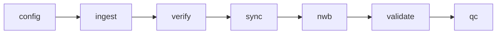

# W2T-BKIN Pipeline Examples

This folder contains examples demonstrating how to use the `w2t_bkin` library for processing body kinematics data. Examples range from basic usage patterns to complete end-to-end pipelines using synthetic data.

## Overview

The examples are organized into three categories:

1. **End-to-End Pipeline Examples** - Complete workflows from data ingestion to NWB export
2. **Modular Component Examples** - Focused examples showing individual pipeline stages
3. **Visualization Examples** - QC plots and figures using the `w2t_bkin.figures` module

All examples use the `synthetic` package to generate test data, so they can run without requiring real experimental recordings.

## Quick Start

### Prerequisites

```bash
# Install the package in development mode
pip install -e .

# Verify installation
python -c "import w2t_bkin; print(w2t_bkin.__version__)"
```

### Running Examples

Each example uses `pydantic-settings` for configuration and can be customized via environment variables:

```bash
# Run with defaults
python examples/01_happy_path_end_to_end.py

# Customize via environment variables
OUTPUT_ROOT=temp/my_output N_FRAMES=500 SEED=123 python examples/01_happy_path_end_to_end.py

# Or set in a .env file
cat > .env << EOF
OUTPUT_ROOT=temp/custom
N_FRAMES=1000
SEED=42
EOF
python examples/01_happy_path_end_to_end.py
```

### Configuration Options

Each example supports environment variables for customization:

**Example 01 (Happy Path End-to-End):**

- `OUTPUT_ROOT`: Output directory (default: `temp/examples/01_happy_path`)
- `N_FRAMES`: Number of frames (default: `200`)
- `SEED`: Random seed (default: `42`)
- `CLEANUP`: Delete output after completion (default: `false`)

**Example 02 (Multi-Camera):**

- `OUTPUT_ROOT`: Output directory (default: `temp/examples/02_multi_camera`)
- `N_CAMERAS`: Number of cameras (default: `2`)
- `N_FRAMES`: Number of frames (default: `200`)
- `SEED`: Random seed (default: `42`)

**Example 03 (Jitter Budget):**

- `OUTPUT_ROOT`: Output directory (default: `temp/examples/03_jitter_budget`)
- `N_FRAMES`: Number of frames (default: `200`)
- `SEED`: Random seed (default: `42`)
- `JITTER_BUDGET_MS`: Jitter budget in milliseconds (default: `2.0`)

**Example 11 (Ingest and Verify):**

- `OUTPUT_ROOT`: Output directory (default: `temp/examples/11_ingest_verify`)
- `N_FRAMES`: Number of frames (default: `200`)
- `SEED`: Random seed (default: `42`)
- `TOLERANCE`: Frame/TTL mismatch tolerance (default: `5`)

**Example 21 (Verification Plots):**

- `OUTPUT_ROOT`: Output directory (default: `temp/examples/21_verification_plots`)
- `VERIFICATION_PATH`: Path to existing verification_summary.json (optional)
- `N_FRAMES`: Number of frames if generating data (default: `200`)
- `SEED`: Random seed if generating data (default: `42`)

**Example 22 (Alignment Plots):**

- `OUTPUT_ROOT`: Output directory (default: `temp/examples/22_alignment_plots`)
- `ALIGNMENT_PATH`: Path to existing alignment_stats.json (optional)
- `N_FRAMES`: Number of frames if generating data (default: `200`)
- `SEED`: Random seed if generating data (default: `42`)
- `JITTER_BUDGET_MS`: Jitter budget in milliseconds (default: `2.0`)
- `SCENARIO`: Scenario to use: `happy_path` or `jitter_exceeds` (default: `happy_path`)

## Example Index

### End-to-End Workflows

| Example                          | Description                                                     | Key Concepts                         |
| -------------------------------- | --------------------------------------------------------------- | ------------------------------------ |
| `01_happy_path_end_to_end.py`    | Complete pipeline: ingest → verify → sync → NWB → validate → QC | Full workflow, sidecars, determinism |
| `02_multi_camera_session.py`     | Multi-camera session with multiple TTL channels                 | Multi-camera, manifest, verification |
| `03_jitter_budget_comparison.py` | Compare happy path vs excessive jitter scenarios                | Timebase, alignment, jitter budget   |

### Modular Components

| Example                     | Description                                | Key Concepts                            |
| --------------------------- | ------------------------------------------ | --------------------------------------- |
| `11_ingest_and_verify.py`   | File discovery, counting, and verification | Manifest, fast/slow modes, verification |
| `12_timebase_and_sync.py`   | Timebase construction and data alignment   | Timebase providers, alignment, jitter   |
| `13_optional_modalities.py` | Adding pose, facemap, and events           | Optional stages, plugin pattern         |
| `14_nwb_assembly.py`        | Assembling NWB files with provenance       | NWB, rate-based ImageSeries, provenance |

### Visualization & QC

| Example                      | Description                              | Key Concepts                                               |
| ---------------------------- | ---------------------------------------- | ---------------------------------------------------------- |
| `21_verification_plots.py`   | Visualize frame/TTL verification results | verification_summary.json, bar plots, root figures package |
| `22_alignment_plots.py`      | Visualize jitter and alignment quality   | alignment_stats.json, jitter distribution, CDF             |
| `23_modality_overlay.ipynb`  | Multi-modal data on unified timebase     | Timebase unification, cross-modal plots                    |
| `24_validation_report.ipynb` | NWB validation and QC summary            | validation_report.json, nwbinspector                       |

## Example Outputs

Each example produces structured outputs in a temporary directory:

```
temp/examples/
├── <example-name>/
│   ├── data/
│   │   └── raw/
│   │       └── <session-id>/       # Synthetic data
│   ├── configs/
│   │   ├── config.toml              # Pipeline config
│   │   └── <session-id>.toml        # Session metadata
│   ├── output/
│   │   ├── verification_summary.json
│   │   ├── alignment_stats.json
│   │   ├── provenance.json
│   │   ├── validation_report.json
│   │   └── <session-id>.nwb         # Final NWB file
│   └── figures/
│       └── *.png                    # QC plots
```

## Key Concepts Demonstrated

### 1. Configuration and Session

All examples start by loading or generating:

- `config.toml` - Pipeline configuration (paths, timebase, tolerances)
- `session.toml` - Session metadata (subject, cameras, TTLs, experimenter)

### 2. Manifest

The **Manifest** is the core data structure connecting configuration to files:

- **Fast discovery**: Enumerate files without counting (`discover_files`)
- **Slow counting**: Count frames and TTL pulses (`populate_manifest_counts`)
- **Verification**: Validate frame/TTL alignment (`verify_manifest`)

### 3. Timebase and Sync

The **Timebase** unifies all data to a common temporal reference:

- **Providers**: nominal_rate, ttl, or neuropixels
- **Alignment**: nearest-neighbor or linear interpolation
- **Jitter budget**: Maximum allowed alignment error

### 4. Sidecars

The pipeline produces JSON sidecars for observability:

- `verification_summary.json` - Frame/TTL verification results
- `alignment_stats.json` - Timebase alignment metrics
- `provenance.json` - Reproducibility metadata
- `validation_report.json` - NWB validation results

### 5. NWB Assembly

Final NWB files contain:

- **Rate-based ImageSeries** - Video data with nominal timestamps
- **Aligned derived data** - Pose, facemap, events on common timebase
- **Provenance** - Configuration hashes, software versions, git info

### 6. Visualization with Root `figures` Package

The **root-level `figures` package** provides QC and visualization tools:

- **Import as**: `import figures.ingest_verify`, `import figures.sync`, etc.
- **Reads sidecars**: Consumes verification_summary.json, alignment_stats.json
- **Domain-driven**: Uses w2t_bkin domain models (AlignmentStats, etc.)
- **Phase-aligned**: Modules organized by pipeline phase
- **Deterministic**: Same inputs produce identical plots

## Design Alignment

These examples directly demonstrate the architecture described in `design.md`:



Each example follows the same phases and produces the same sidecars as the production pipeline.

## Tips for Adapting to Real Data

1. **Replace synthetic data generation** with your actual data directory
2. **Update config.toml** with real paths and parameters
3. **Create session.toml** files for each experimental session
4. **Run verification first** to check data integrity before heavy processing
5. **Review sidecars** to diagnose issues and tune parameters
6. **Use figures module** to generate QC reports for your sessions

## Contributing

When adding new examples:

1. Use descriptive filenames with numeric prefixes (01*, 11*, 21\_)
2. Include docstrings explaining the purpose and key concepts
3. Generate synthetic data in a temporary directory
4. Clean up temporary files at the end (or use `tempfile`)
5. Update this README with a table entry

## Support

For questions or issues:

- See `design.md` for architecture details
- See `requirements.md` for functional requirements
- See module docstrings for API documentation
- Open an issue on GitHub for bugs or feature requests
